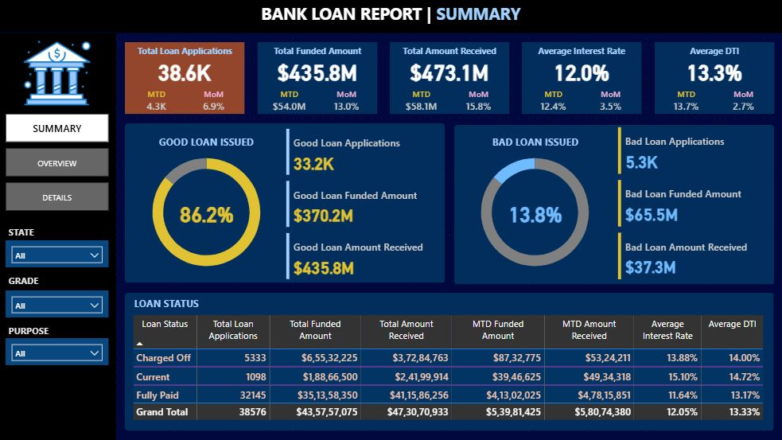
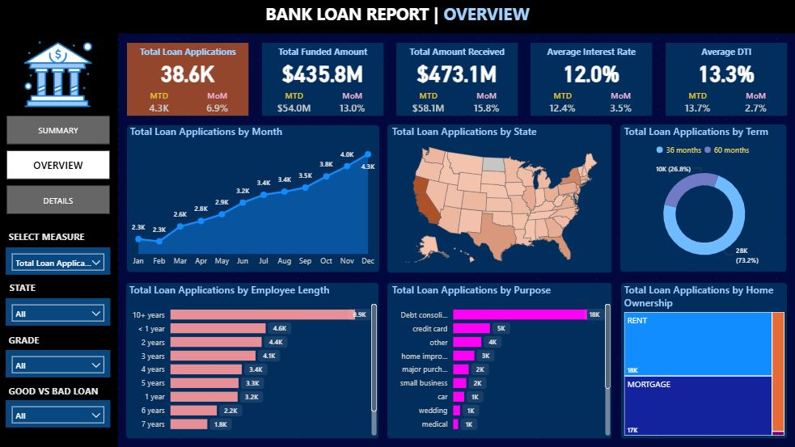
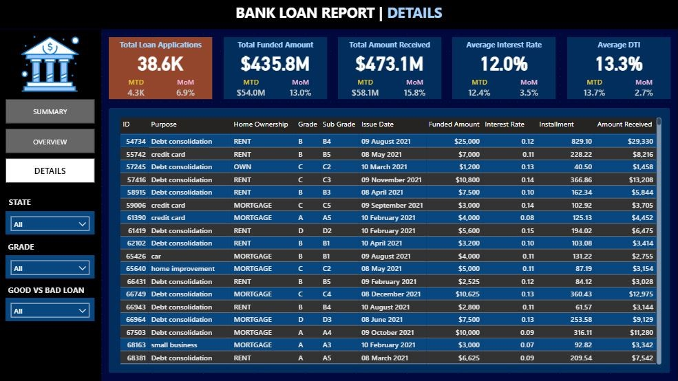
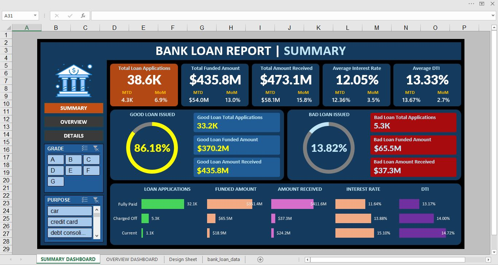
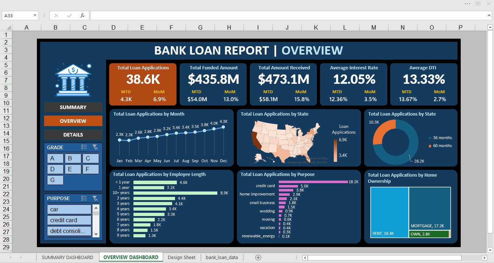

# Credit Risk Assessment & Non-Performing Loan (NPL) Analysis

## 📌 Project Overview
This project establishes a quantitative risk framework for a **consumer loan portfolio** (38,000+ records, **$435M** Total Principal). The analysis was performed using a **Dual-Platform Strategy** (Power BI & Excel) validated by SQL and Python to ensure data integrity and cross-platform consistency.

## 🎯 Business Objectives
1.  **Loss Quantification:** Calculated **$28.2M** in Potential Credit Exposure (EAD) from Charged-Off loans.
2.  **Risk Segmentation:** Segmented portfolio into 'Good' (86.2%) vs 'Bad' (13.8%) loans to track Asset Quality.
3.  **Concentration Risk:** Analyzed geographical and grade-based exposure to identify high-risk segments (Grades F-G).

## 🛠 Tech Stack & Methodology
* **Python (Pandas/NumPy):** Used for initial Data Cleaning and Exploratory Data Analysis (EDA).
* **SQL (PostgreSQL):** Utilized **Window Functions** and **CTEs** to verify KPI calculations (MoM, MTD) across 38k records.
* **Power BI:** Built an interactive dashboard with **DAX measures** for dynamic filtering (Grade, Purpose, State).
* **Advanced Excel:** Designed a parallel dashboard using **Pivot Tables** and **Slicers** to simulate legacy banking reporting environments.

---

## 📊 Dashboard Showcase

### 🔹 1. Power BI: Executive Risk Summary
*Visualizes the Hero KPIs ($435M Funded) and the "Good vs Bad" Loan Split (13.8% NPL).*

### 🔹 2. Power BI: Geographical Concentration Risk
*Heatmap analysis showing exposure by State, correlated with Borrower Grades.*

### 🔹 3. Power BI: Borrower Details Grid
*Granular view of individual loan applications allowing for deep-dive auditing.*

### 🔹 4. Excel: Interactive Managerial Dashboard
*A fully interactive report built with **Pivot Charts** and **Timeline Slicers**, demonstrating capability to modernize legacy Excel workflows.*

### 🔹 5. Excel: Overview & Trends
*Detailed trend analysis showing loan originations and risk distribution over time.*

---

## 🔑 Key Findings & Risk Insights
* **NPL Rate:** The portfolio carries a **13.8% NPL rate**, largely driven by **Grade F & G** loans (which have >25% default rates).
* **Exposure:** Total "Bad Loan" amount stands at **$28.2M** (Charged Off).
* **Loan Purpose:** "Debt Consolidation" is the primary driver of loan volume but maintains a stable repayment profile compared to "Small Business" loans.

## 📂 Repository Structure
* [credit_risk_npl_analysis.ipynb](credit_risk_npl_analysis.ipynb): Python Notebook for Data Cleaning & EDA.
* [credit_risk_npl_queries.sql](credit_risk_npl_queries.sql): SQL scripts for KPI verification.
* `dashboard_*.JPG`: Dashboard Screenshots (View above).
